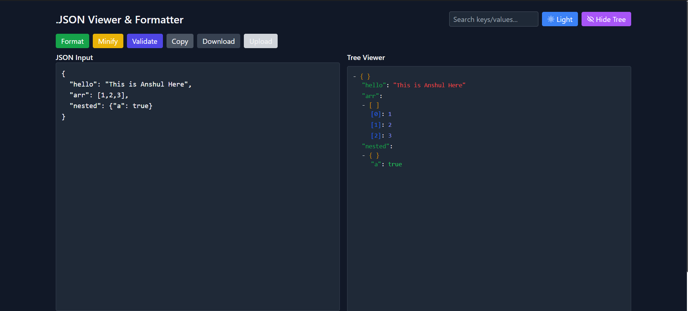
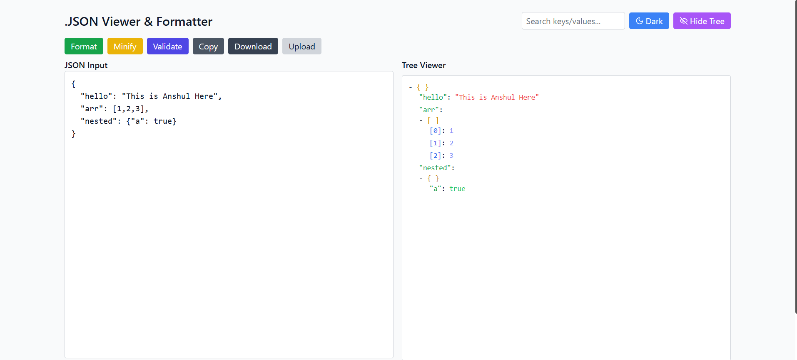

# 🌳 JSON Viewer & Formatter  

A powerful and minimal **JSON Viewer, Formatter & Validator** built with **React + TailwindCSS**.  
Easily format, minify, validate, search, copy, upload, and download JSON data in a clean and modern interface.  

Live Demo: [🔗 https://json00.netlify.app/](#)  

---

## ✨ Features  

- ✅ **Format JSON** – Beautify messy JSON into readable format.  
- ✅ **Minify JSON** – Compress JSON into a single line.  
- ✅ **Validate JSON** – Instantly check if JSON is valid.  
- ✅ **Tree Viewer** – Toggle JSON tree view with expand/collapse.  
- ✅ **Search** – Quickly find keys/values inside JSON.  
- ✅ **Theme Toggle** – Switch between **Dark & Light** mode.  
- ✅ **Clipboard Support** – Copy JSON with one click.  
- ✅ **File Upload & Download** – Upload JSON files or export as `.json`.  
- ✅ **Custom Scrollbar** – Sleek themed scrollbars for better UX.  
- ✅ **Responsive UI** – Works seamlessly on desktop & mobile.  

---

## 🚀 Tech Stack  

- ⚛️ **React 18**  
- 🎨 **TailwindCSS**  
- 🌗 **Dark/Light Theme**  
- 📦 **Lucide Icons**  

---

## 📸 Screenshots  

### 🔹 Dark Mode  
  

### 🔹 Light Mode  
  

---

## ⚡ Installation  

Clone the repo and install dependencies:  

```bash
git clone https://github.com/anshul00000/JSON_VIEWER.git
cd JSON_VIEWER
npm install
npm run dev